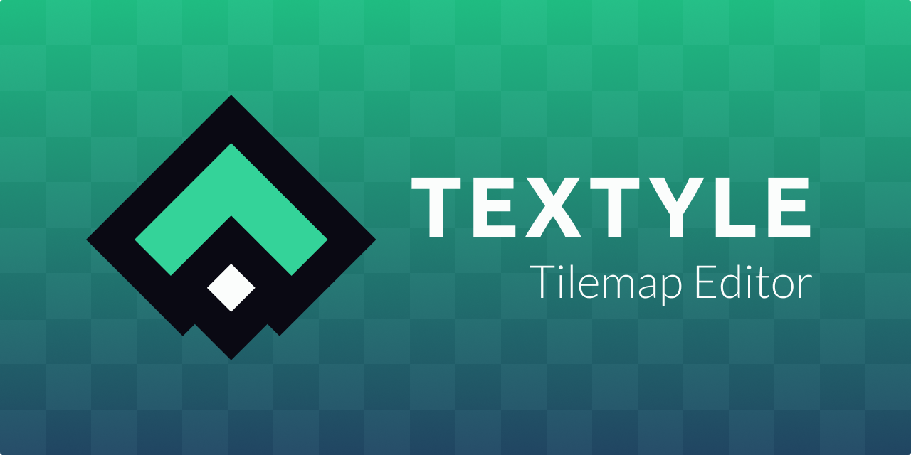

[Try Textyle!](https://textyle.app/edit)

# What is Textyle?

Textyle is a simple web-based tilemap editor for 2D games built using React JS and Rust (WASM).

Textyle aims to simplify and speed up the process of making tilemaps for your games. Running on the web means that you don't have to download any additional tools for creating your maps, and exporting it to an easy format means that you don't have to add additional libraries or plugins to your game.

The project is in its initial stages of development, expect great improvements to come!

# Getting started

Textyle UI is simple. Check the [wiki](https://github.com/stefandevai/textyle/wiki) for tutorials on how to start making your maps. However, you are encouraged to explore the application and leave the mouse on any term or box as almost everything has a [tooltip](https://en.wikipedia.org/wiki/Tooltip) indicating its use.

# Integrating a Textyle map to your project

Currently Textyle exports to JSON. It's a simple and widely used format in game development, you can use any JSON parser to get you tilemap data to your game; check the details [here](https://github.com/stefandevai/textyle/wiki). One of the priorities, however, is to allow multiple export targets so it will be a lot easier to integrate your map to the most common game engines.

# Features so far

- Multiple layers
- Multiple tilesets
- Tools:
  - Pencil
  - Fill
  - Zoom
  - Pan
- JSON export
- Batch Rendering

# Coming soon

- Autotile
- Custom brushes
- CSV and tmx format exports
- Selections (free, rectangular, magic wand)
- Support for isometric and hexagonal tiles
- Data layers
- Custom parameters on tiles
- Images over the tiles
- Undo/Redo

# Technical overview

**Stack:**

- React JS
- WebGL
- Rust (WASM)

Textyle is built using React JS for the UI, WebGL for rendering graphics and Rust (WASM) for managing tiles data and logic. In this sense, we try to explore each technology's strength: React JS for easily building complex UIs, WebGL API for rendering using the GPU and Rust compiled to WASM for managing tilemap's logic and algorithms with high performance.

# Browser support

Textyle has been tested on Firefox and Chrome. Currently it doesn't run on Safari because it needs WebGL2 support, which Safari lacks. There are plans, however, to port the code to WebGL1.

# Contributing

Are you learning Rust, JavaScript or React? Are you an expert already? Found a way to improve the code? You are more than welcome to contribute to this project! But before that, please check our [code of conduct](./CODE_OF_CONDUCT.md) and take a look on the guidelines for [contributing](./CONTRIBUTING.md).
